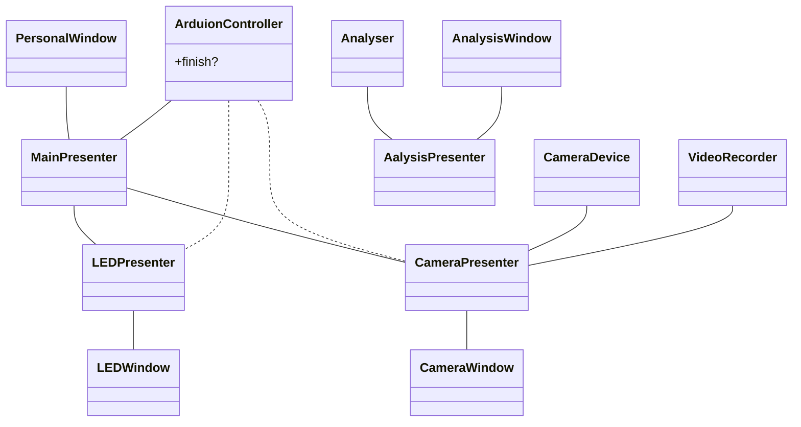
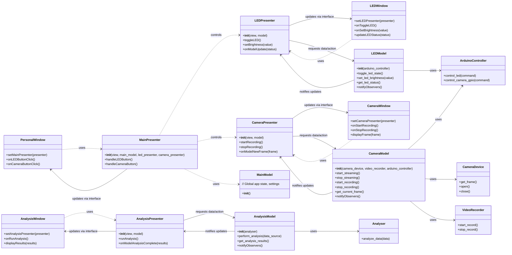
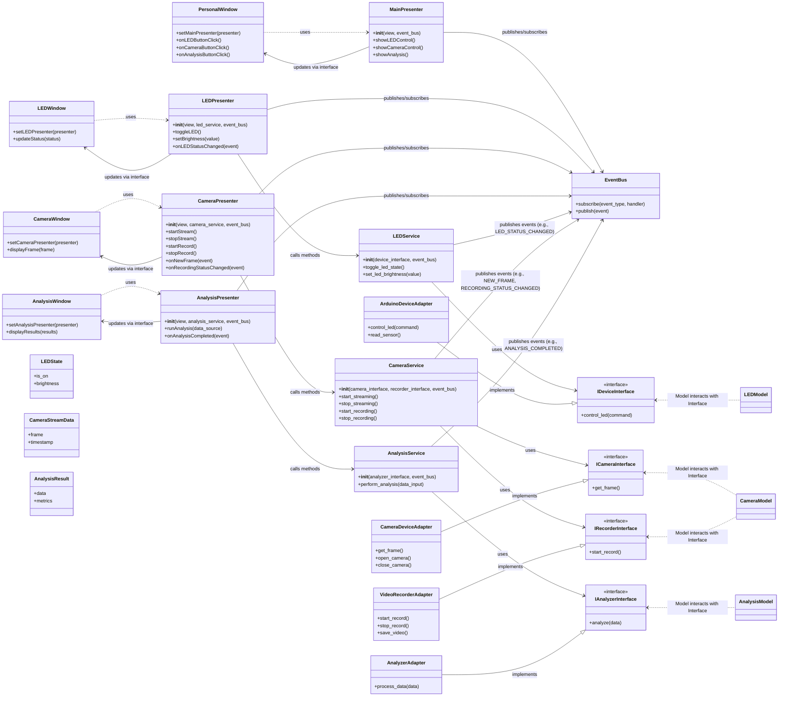
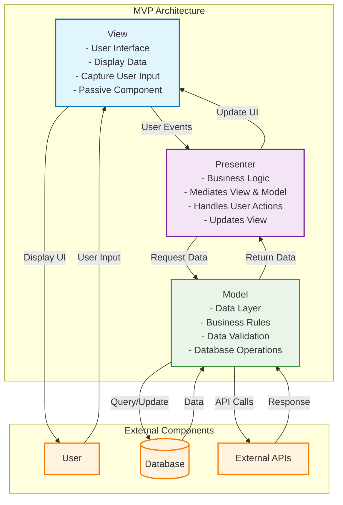

```mermaid
classDiagram


MainPresenter -- LEDPresenter
MainPresenter -- CameraPresenter

PersonalWindow -- MainPresenter
ArduionController -- MainPresenter
ArduionController .. LEDPresenter

ArduionController .. CameraPresenter
CameraDevice -- CameraPresenter
VideoRecorder -- CameraPresenter
LEDPresenter -- LEDWindow
CameraPresenter -- CameraWindow

Analyser -- AalysisPresenter
AnalysisWindow -- AalysisPresenter


class ArduionController {
    +finish?
}

```

```mermaid
classDiagram
    direction LR

    class PersonalWindow {
        +setMainPresenter(presenter)
        +onLEDButtonClick()
        +onCameraButtonClick()
    }

    class LEDWindow {
        +setLEDPresenter(presenter)
        +onToggleLED()
        +onSetBrightness(value)
        +updateLEDStatus(status)
    }

    class CameraWindow {
        +setCameraPresenter(presenter)
        +onStartRecording()
        +onStopRecording()
        +displayFrame(frame)
    }

    class AnalysisWindow {
        +setAnalysisPresenter(presenter)
        +onRunAnalysis()
        +displayResults(results)
    }

    class MainPresenter {
        +__init__(view, main_model, led_presenter, camera_presenter)
        +handleLEDButton()
        +handleCameraButton()
    }

    class LEDPresenter {
        +__init__(view, model)
        +toggleLED()
        +setBrightness(value)
        +onModelUpdate(status)
    }

    class CameraPresenter {
        +__init__(view, model)
        +startRecording()
        +stopRecording()
        +onModelNewFrame(frame)
    }

    class AnalysisPresenter {
        +__init__(view, model)
        +runAnalysis()
        +onModelAnalysisComplete(results)
    }

    class MainModel {
        +__init__()
        // Global app state, settings
    }

    class LEDModel {
        +__init__(arduino_controller)
        +toggle_led_state()
        +set_led_brightness(value)
        +get_led_status()
        +notifyObservers()
    }

    class CameraModel {
        +__init__(camera_device, video_recorder, arduino_controller)
        +start_streaming()
        +stop_streaming()
        +start_recording()
        +stop_recording()
        +get_current_frame()
        +notifyObservers()
    }

    class AnalysisModel {
        +__init__(analyser)
        +perform_analysis(data_source)
        +get_analysis_results()
        +notifyObservers()
    }

    class ArduinoController {
        +control_led(command)
        +control_camera_gpio(command)
    }

    class CameraDevice {
        +get_frame()
        +open()
        +close()
    }

    class VideoRecorder {
        +start_record()
        +stop_record()
    }

    class Analyser {
        +analyze_data(data)
    }


    PersonalWindow ..> MainPresenter : uses
    MainPresenter --> PersonalWindow : updates via interface

    MainPresenter ..> LEDPresenter : controls
    MainPresenter ..> CameraPresenter : controls

    LEDWindow ..> LEDPresenter : uses
    LEDPresenter --> LEDWindow : updates via interface
    LEDPresenter --> LEDModel : requests data/action
    LEDModel --> LEDPresenter : notifies updates

    CameraWindow ..> CameraPresenter : uses
    CameraPresenter --> CameraWindow : updates via interface
    CameraPresenter --> CameraModel : requests data/action
    CameraModel --> CameraPresenter : notifies updates

    AnalysisWindow ..> AnalysisPresenter : uses
    AnalysisPresenter --> AnalysisWindow : updates via interface
    AnalysisPresenter --> AnalysisModel : requests data/action
    AnalysisModel --> AnalysisPresenter : notifies updates

    LEDModel --> ArduinoController : uses
    CameraModel --> ArduinoController : uses
    CameraModel --> CameraDevice : uses
    CameraModel --> VideoRecorder : uses
    AnalysisModel --> Analyser : uses

    MainPresenter ..> MainModel : uses
```

---

```mermaid
classDiagram
    direction LR

    %% Views (UI)
    class PersonalWindow {
        +setMainPresenter(presenter)
        +onLEDButtonClick()
        +onCameraButtonClick()
        +onAnalysisButtonClick()
    }
    class LEDWindow {
        +setLEDPresenter(presenter)
        +updateStatus(status)
    }
    class CameraWindow {
        +setCameraPresenter(presenter)
        +displayFrame(frame)
    }
    class AnalysisWindow {
        +setAnalysisPresenter(presenter)
        +displayResults(results)
    }

    %% Presenters (UI Logic)
    class MainPresenter {
        +__init__(view, event_bus)
        +showLEDControl()
        +showCameraControl()
        +showAnalysis()
    }
    class LEDPresenter {
        +__init__(view, led_service, event_bus)
        +toggleLED()
        +setBrightness(value)
        +onLEDStatusChanged(event)
    }
    class CameraPresenter {
        +__init__(view, camera_service, event_bus)
        +startStream()
        +stopStream()
        +startRecord()
        +stopRecord()
        +onNewFrame(event)
        +onRecordingStatusChanged(event)
    }
    class AnalysisPresenter {
        +__init__(view, analysis_service, event_bus)
        +runAnalysis(data_source)
        +onAnalysisCompleted(event)
    }

    %% Services (Business Logic & Orchestration)
    class LEDService {
        +__init__(device_interface, event_bus)
        +toggle_led_state()
        +set_led_brightness(value)
    }
    class CameraService {
        +__init__(camera_interface, recorder_interface, event_bus)
        +start_streaming()
        +stop_streaming()
        +start_recording()
        +stop_recording()
    }
    class AnalysisService {
        +__init__(analyzer_interface, event_bus)
        +perform_analysis(data_input)
    }

    %% Domain Models / Entities (Data Structures)
    class LEDState {
        +is_on
        +brightness
    }
    class CameraStreamData {
        +frame
        +timestamp
    }
    class AnalysisResult {
        +data
        +metrics
    }

    %% Infrastructure / Adapters (External Services)
    class ArduinoDeviceAdapter {
        +control_led(command)
        +read_sensor()
    }
    class CameraDeviceAdapter {
        +get_frame()
        +open_camera()
        +close_camera()
    }
    class VideoRecorderAdapter {
        +start_record()
        +stop_record()
        +save_video()
    }
    class AnalyzerAdapter {
        +process_data(data)
    }

    %% Cross-cutting Concerns
    class EventBus {
        +subscribe(event_type, handler)
        +publish(event)
    }

    %% Interfaces (Abstract Base Classes for Dependencies)
    class IDeviceInterface {
        <<interface>>
        +control_led(command)
    }
    class ICameraInterface {
        <<interface>>
        +get_frame()
    }
    class IRecorderInterface {
        <<interface>>
        +start_record()
    }
    class IAnalyzerInterface {
        <<interface>>
        +analyze(data)
    }

    %% Relationships

    PersonalWindow ..> MainPresenter : uses
    MainPresenter --> EventBus : publishes/subscribes
    MainPresenter --> PersonalWindow : updates via interface

    LEDWindow ..> LEDPresenter : uses
    LEDPresenter --> EventBus : publishes/subscribes
    LEDPresenter --> LEDWindow : updates via interface
    LEDPresenter --> LEDService : calls methods

    CameraWindow ..> CameraPresenter : uses
    CameraPresenter --> EventBus : publishes/subscribes
    CameraPresenter --> CameraWindow : updates via interface
    CameraPresenter --> CameraService : calls methods

    AnalysisWindow ..> AnalysisPresenter : uses
    AnalysisPresenter --> EventBus : publishes/subscribes
    AnalysisPresenter --> AnalysisWindow : updates via interface
    AnalysisPresenter --> AnalysisService : calls methods

    LEDService --> IDeviceInterface : uses
    CameraService --> ICameraInterface : uses
    CameraService --> IRecorderInterface : uses
    AnalysisService --> IAnalyzerInterface : uses

    LEDService --> EventBus : publishes events (e.g., LED_STATUS_CHANGED)
    CameraService --> EventBus : publishes events (e.g., NEW_FRAME, RECORDING_STATUS_CHANGED)
    AnalysisService --> EventBus : publishes events (e.g., ANALYSIS_COMPLETED)

    ArduinoDeviceAdapter --|> IDeviceInterface : implements
    CameraDeviceAdapter --|> ICameraInterface : implements
    VideoRecorderAdapter --|> IRecorderInterface : implements
    AnalyzerAdapter --|> IAnalyzerInterface : implements

    IDeviceInterface <.. LEDModel : Model interacts with Interface
    ICameraInterface <.. CameraModel : Model interacts with Interface
    IRecorderInterface <.. CameraModel : Model interacts with Interface
    IAnalyzerInterface <.. AnalysisModel : Model interacts with Interface
```

```mermaid
graph TB
    subgraph "MVP Architecture"
        V[View<br/>- User Interface<br/>- Display Data<br/>- Capture User Input<br/>- Passive Component]
        P[Presenter<br/>- Business Logic<br/>- Mediates View & Model<br/>- Handles User Actions<br/>- Updates View]
        M[Model<br/>- Data Layer<br/>- Business Rules<br/>- Data Validation<br/>- Database Operations]
    end
    
    subgraph "External Components"
        U[User]
        DB[(Database)]
        API[External APIs]
    end
    
    %% User interactions
    U -->|User Input| V
    V -->|Display UI| U
    
    %% MVP interactions
    V -->|User Events| P
    P -->|Update UI| V
    P -->|Request Data| M
    M -->|Return Data| P
    
    %% External data sources
    M -->|Query/Update| DB
    M -->|API Calls| API
    DB -->|Data| M
    API -->|Response| M
    
    %% Styling
    classDef viewStyle fill:#e1f5fe,stroke:#0277bd,stroke-width:2px
    classDef presenterStyle fill:#f3e5f5,stroke:#7b1fa2,stroke-width:2px
    classDef modelStyle fill:#e8f5e8,stroke:#388e3c,stroke-width:2px
    classDef externalStyle fill:#fff3e0,stroke:#f57c00,stroke-width:2px
    
    class V viewStyle
    class P presenterStyle
    class M modelStyle
    class U,DB,API externalStyle
```